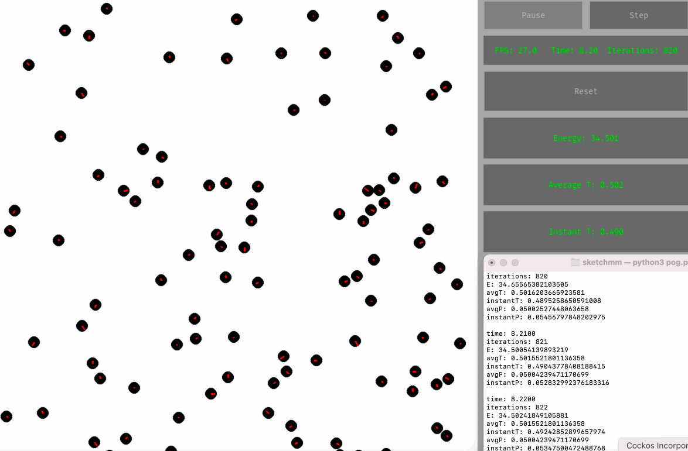
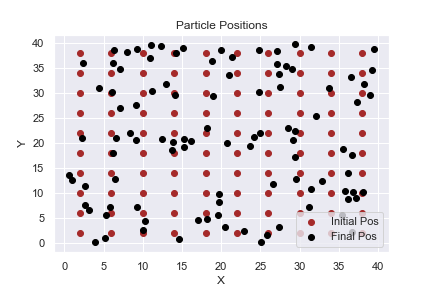
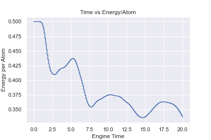
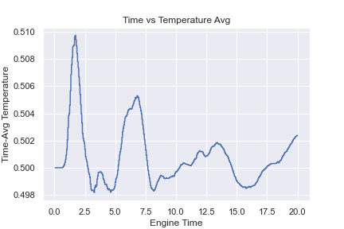
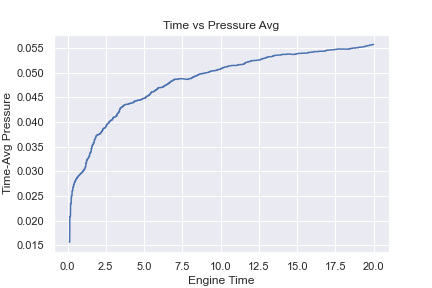
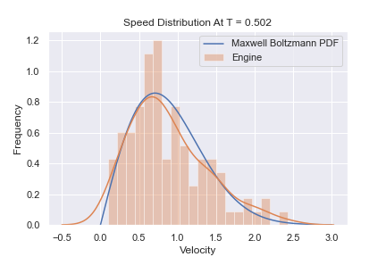

# SketchMM
a 2D classical molecular dynamics simulation written in python3.

### Background and Methodology

This simulation revolves around using the LJ potential energy function to calculate all forces between atoms. It is aiming to simulate a system of "real" gas particles such that the velocity of the system relaxes towards a Maxwell-Boltzmann distribution. The "sketch" comes from the fact that it uses simple rendered graphics. 

### Notes
The settings.yaml file is what modifies the settings for each simulation. Everything is stable as long as temperature values are not set too high, as this appears to cause issues with the periodic boundary conditions. 
The pog.py file is what runs the rendered version of the engine, based on the settings of settings.yaml. 

### Molecular Dynamics in a Nutshell
The model for MD can be broken down into 5 distinct steps:

1. Initialization of particle positions and particle velocities.

2. Calculate forces and update positions and velocities according to velocity verlet integration. 

3. Apply boundary conditions and control temperature or pressure if needed.

4. Calculate relevant statistics of the system.

5. Repeat step 2-4 until a fixed number of time steps have elapsed. 
### Graphs
- All graphs are obtained from the test.ipynb file, which uses an instance of the sketchmm engine with 2000 time steps. 

 

- Positions from initialization to end of simulation. 

- Energy, kinetic energy + LJ-potentials. 

- Temperature, which we fix and recalculate for at 0.5 units for simulation.

- Pressure, which is probably calculated wrong.

- Maxwell-Boltzmann Distribution, measured at the last time step of simulation.

# TODO
- Add GUI widgets for Matplotlib and graphing
- Add text boxes for FPS and system values (temp, P, etc)
- Add in color mapping for velocity? more red = faster particle, switch with arrows? 
- Improve performance, possibly add C bindings for force calculation
- Rewrite perft function to benchmark force calculation
# Reference
https://arxiv.org/pdf/2001.07089.pdf\
http://physics.weber.edu/schroeder/md/InteractiveMD.pdf\
http://www.courses.physics.helsinki.fi/fys/moldyn/lectures/L4.pdf\
https://web.northeastern.edu/afeiguin/p4840/p131spring04/node41.html\
https://arxiv.org/pdf/1111.2705.pdf\
http://fab.cba.mit.edu/classes/864.11/people/dhaval_adjodah/final_project/write_up_boltzmann.pdf